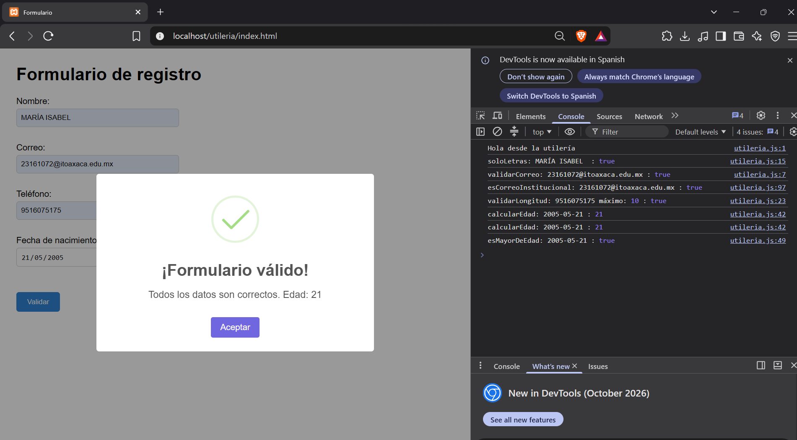
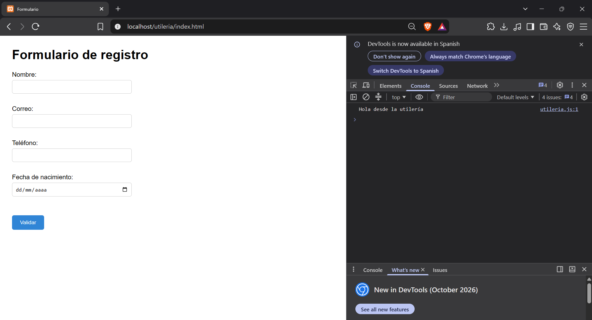
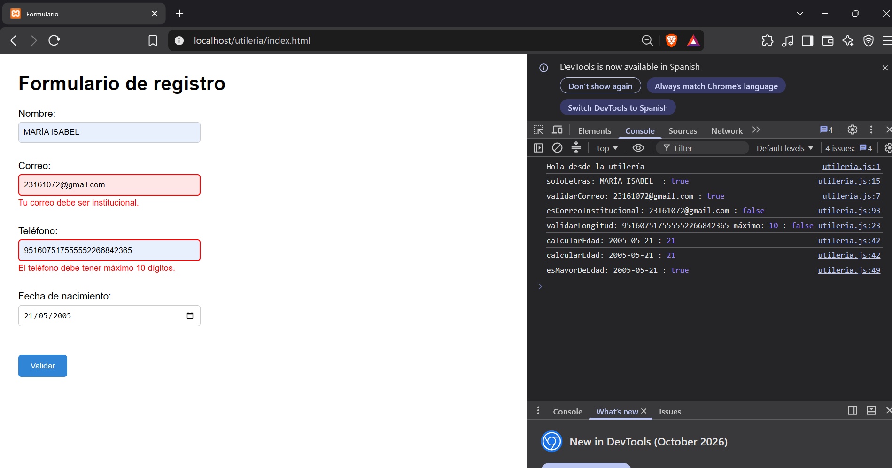
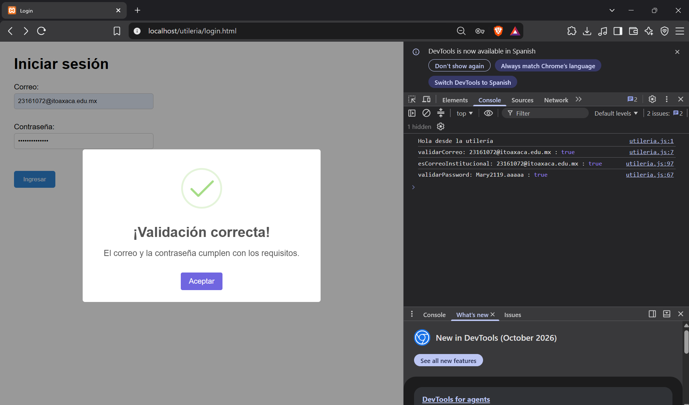
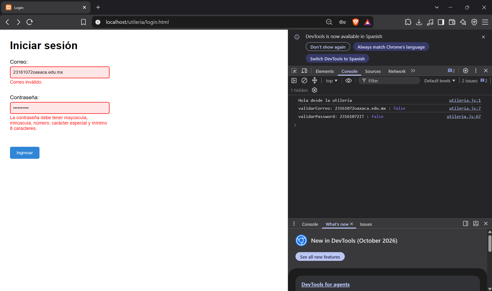
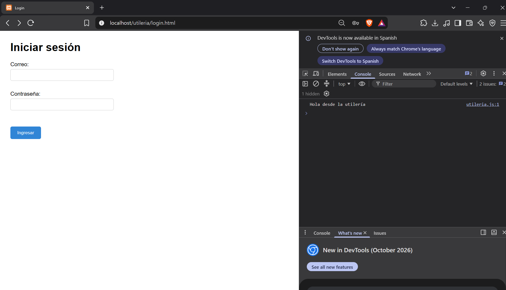

# Utileria.js

Librería de funciones JavaScript para validar datos comunes en formularios web. Resuelve la necesidad de centralizar validaciones de nombres, correos electrónicos (incluyendo correos institucionales), teléfonos (y su lada/estado de origen), edades y contraseñas seguras, evitando repetir la misma lógica en cada formulario de un proyecto.

## Instalación

Copia `utileria.js` en tu proyecto e inclúyelo antes del script que utilizará sus funciones:

```html
<script src="utileria.js"></script>
```

Por ejemplo, en una página HTML:

```html
<!DOCTYPE html>
<html lang="es">
<head>
    <meta charset="UTF-8">
    <title>Formulario</title>
    <script src="utileria.js"></script>
</head>
<body>
    <!-- Contenido de la página -->
</body>
</html>
```

## Uso

Las funciones quedan disponibles globalmente después de cargar `utileria.js`.

### Validar correo, correo institucional y texto

```javascript
const correoValido = validarCorreo('ana@ejemplo.com');
const nombreValido = soloLetras('Ana Pérez');
const esInstitucional = esCorreoInstitucional('ana@ejemplo.com');

console.log(correoValido);    // true
console.log(nombreValido);    // true
console.log(esInstitucional); // false (gmail.com está en la lista de proveedores gratuitos)
```

### Validar longitud y teléfono

```javascript
const numeroValido = validarLongitud(12345, 5);
const telefonoValido = validarLongitud('9511234567', 10);

console.log(numeroValido);   // true
console.log(telefonoValido); // true
```

### Calcular edad y verificar mayoría de edad

```javascript
const fechaNacimiento = '2000-05-15';
const edad = calcularEdad(fechaNacimiento);
const esMayor = esMayorDeEdad(fechaNacimiento);

console.log(`Edad: ${edad}`);
console.log(`¿Es mayor de edad?: ${esMayor}`);
```

### Validar una contraseña

```javascript
const password = 'Clave#123';

if (validarPassword(password)) {
    console.log('La contraseña cumple todos los requisitos.');
} else {
    console.log('La contraseña no cumple los requisitos.');
}
```

La contraseña debe contener como mínimo 8 caracteres, una letra mayúscula, una letra minúscula, un número y un carácter especial.

### Detectar el estado a partir del teléfono

```javascript
const estado = validarEstado('9511234567');

console.log(estado); // "oaxaca"
```

`validarEstado` toma los primeros 3 dígitos del número (la lada) y los compara contra un catálogo interno. Si la lada no está registrada, devuelve `"Desconocido"`.

### Validar un formulario completo

```javascript
document.getElementById('formulario').addEventListener('submit', function (event) {
    event.preventDefault();

    let nombre = document.getElementById('nombre');
    let correo = document.getElementById('correo');
    let telefono = document.getElementById('telefono');
    let fecha = document.getElementById('fechaNacimiento');

    let errorNombre = document.getElementById('errorNombre');
    let errorCorreo = document.getElementById('errorCorreo');
    let errorTelefono = document.getElementById('errorTelefono');
    let errorFecha = document.getElementById('errorFecha');

    nombre.classList.remove('input-error');
    correo.classList.remove('input-error');
    telefono.classList.remove('input-error');
    fecha.classList.remove('input-error');

    errorNombre.textContent = '';
    errorCorreo.textContent = '';
    errorTelefono.textContent = '';
    errorFecha.textContent = '';

    if (!soloLetras(nombre.value)) {
        nombre.classList.add('input-error');
        errorNombre.textContent = 'El nombre solo debe contener letras.';
        return;
    }

    if (!validarCorreo(correo.value)) {
        correo.classList.add('input-error');
        errorCorreo.textContent = 'El correo no es válido.';
        return;
    }

    if (!esCorreoInstitucional(correo.value)) {
        correo.classList.add("input-error");
        errorCorreo.textContent = "Tu correo debe ser institucional.";
        return;
    }

    if (!validarLongitud(telefono.value, 10)) {
        telefono.classList.add('input-error');
        errorTelefono.textContent = 'El teléfono debe tener máximo 10 dígitos.';
        return;
    }

    if (fecha.value === '') {
        fecha.classList.add('input-error');
        errorFecha.textContent = 'Selecciona una fecha de nacimiento.';
        return;
    }

    let edad = calcularEdad(fecha.value);

    if (edad < 0) {
        fecha.classList.add('input-error');
        errorFecha.textContent = 'La fecha de nacimiento no es válida.';
        return;
    }

    if (!esMayorDeEdad(fecha.value)) {
        fecha.classList.add('input-error');
        errorFecha.textContent = 'Debes ser mayor de edad.';
        return;
    }

    console.log(validarEstado(telefono.value));

    Swal.fire({
        icon: 'success',
        title: '¡Formulario válido!',
        text: 'Todos los datos son correctos. Edad: ' + edad,
        confirmButtonText: 'Aceptar'
    });
});
```

## Documentación de funciones

La siguiente documentación utiliza una estructura similar a JavaDoc. Cada función incluye su firma, propósito, parámetros, valor de retorno y un ejemplo de uso.

### `validarCorreo(correo)`

**Firma:**

```javascript
validarCorreo(correo) // boolean
```

**Descripción:** valida que una cadena tenga una estructura básica de correo electrónico mediante una expresión regular. El formato esperado contiene texto antes de `@`, un dominio después de `@` y una extensión separada por un punto.

**Parámetros:**

| Parámetro | Tipo | Descripción |
| --- | --- | --- |
| `correo` | `string` | Dirección de correo que se desea comprobar. |

**Retorno:** `true` si el correo cumple el formato básico; en caso contrario, `false`.

**Ejemplo:**

```javascript
const valido = validarCorreo('ana@ejemplo.com');
const invalido = validarCorreo('ana@ejemplo');

console.log(valido);   // true
console.log(invalido); // false
```

### `soloLetras(texto)`

**Firma:**

```javascript
soloLetras(texto) // boolean
```

**Descripción:** comprueba que el texto contenga únicamente letras, espacios, vocales acentuadas y las letras `ñ` o `Ñ`. Es útil para validar nombres y apellidos.

**Parámetros:**

| Parámetro | Tipo | Descripción |
| --- | --- | --- |
| `texto` | `string` | Texto que se desea validar. |

**Retorno:** `true` si todos los caracteres pertenecen al conjunto permitido; `false` si contiene números, símbolos u otros caracteres.

**Ejemplo:**

```javascript
console.log(soloLetras('María López')); // true
console.log(soloLetras('Ana123'));      // false
console.log(soloLetras('Pedro_'));      // false
```

### `validarLongitud(numero, maxLongitud)`

**Firma:**

```javascript
validarLongitud(numero, maxLongitud) // boolean
```

**Descripción:** convierte el valor recibido a texto y cuenta sus caracteres. Después compara esa cantidad con la longitud máxima indicada.

**Parámetros:**

| Parámetro | Tipo | Descripción |
| --- | --- | --- |
| `numero` | `number` o `string` | Valor cuya longitud se quiere comprobar. |
| `maxLongitud` | `number` | Número máximo de caracteres permitidos. |

**Retorno:** `true` si la longitud del valor es menor o igual que `maxLongitud`; `false` si la supera.

**Ejemplo:**

```javascript
console.log(validarLongitud(12345, 5));    // true
console.log(validarLongitud('123456', 5)); // false
```

### `calcularEdad(fechaNacimiento)`

**Firma:**

```javascript
calcularEdad(fechaNacimiento) // number
```

**Descripción:** calcula la edad en años completos a partir de la fecha de nacimiento y la fecha actual del sistema. Si el cumpleaños todavía no ha ocurrido durante el año actual (mes o día), resta un año al resultado.

**Parámetros:**

| Parámetro | Tipo | Descripción |
| --- | --- | --- |
| `fechaNacimiento` | `string` en formato `AAAA-MM-DD` | Fecha de nacimiento, por ejemplo, `'2000-05-15'`. |

**Retorno:** edad calculada como un número entero.

**Ejemplo:**

```javascript
const edad = calcularEdad('2000-05-15');

console.log(`La edad es: ${edad}`);
```

### `esMayorDeEdad(fechaNacimiento)`

**Firma:**

```javascript
esMayorDeEdad(fechaNacimiento) // boolean
```

**Descripción:** utiliza `calcularEdad()` internamente para determinar si una persona tiene 18 años o más.

**Parámetros:**

| Parámetro | Tipo | Descripción |
| --- | --- | --- |
| `fechaNacimiento` | `string` en formato `AAAA-MM-DD` | Fecha de nacimiento de la persona. |

**Retorno:** `true` si la edad es mayor o igual a 18; `false` si es menor.

**Ejemplo:**

```javascript
const fechaNacimiento = '2000-05-15';

if (esMayorDeEdad(fechaNacimiento)) {
    console.log('La persona puede continuar.');
} else {
    console.log('La persona debe ser mayor de edad.');
}
```

### `validarPassword(password)`

**Firma:**

```javascript
validarPassword(password) // boolean
```

**Descripción:** comprueba que una contraseña cumpla los cinco requisitos de seguridad: mínimo 8 caracteres, al menos una mayúscula, una minúscula, un número y un carácter especial.

**Parámetros:**

| Parámetro | Tipo | Descripción |
| --- | --- | --- |
| `password` | `string` | Contraseña que se desea validar. |

**Retorno:** `true` únicamente cuando se cumplen las cinco condiciones; de lo contrario, `false`.

**Ejemplo:**

```javascript
console.log(validarPassword('Clave#123')); // true
console.log(validarPassword('clave123'));  // false: falta mayúscula y carácter especial
console.log(validarPassword('Clave#'));    // false: tiene menos de 8 caracteres
```

### `esCorreoInstitucional(correo)`

**Firma:**

```javascript
esCorreoInstitucional(correo) // boolean
```

**Descripción:** convierte el correo a minúsculas, extrae el dominio (lo que sigue después de `@`) y verifica que **no** pertenezca a una lista de proveedores de correo gratuitos (`gmail.com`, `yahoo.com`, `hotmail.com`, `outlook.com`, `icloud.com`). Si el correo no tiene un formato reconocible o su dominio está en la lista de proveedores gratuitos, se considera que no es institucional.

**Parámetros:**

| Parámetro | Tipo | Descripción |
| --- | --- | --- |
| `correo` | `string` | Correo electrónico que se desea comprobar. |

**Retorno:** `true` si el dominio no es un proveedor gratuito conocido; `false` en caso contrario o si el correo no tiene un formato válido.

**Ejemplo:**

```javascript
console.log(esCorreoInstitucional('ana@gmail.com'));       // false
console.log(esCorreoInstitucional('ana@miuniversidad.mx')); // true
```

### `validarEstado(numero)`

**Firma:**

```javascript
validarEstado(numero) // string
```

**Descripción:** toma los primeros 3 dígitos (la lada) de un número telefónico y los compara contra un catálogo interno para devolver el nombre del estado o ciudad correspondiente. Además imprime la lada detectada en la consola. Si la lada no está registrada en el catálogo, devuelve `"Desconocido"`.

**Parámetros:**

| Parámetro | Tipo | Descripción |
| --- | --- | --- |
| `numero` | `number` o `string` | Número telefónico del cual se extraerá la lada. |

**Retorno:** `string` con el nombre del estado o ciudad (`"oaxaca"`, `"Cancún"`, `"Chihuahua"`, `"Puebla"`, `"Morelia"`, `"Querétaro"`) o `"Desconocido"` si la lada no coincide con ninguna registrada.

**Ejemplo:**

```javascript
console.log(validarEstado('9511234567')); // "951" (impreso en consola) -> "oaxaca"
console.log(validarEstado('9981234567')); // "998" (impreso en consola) -> "Cancún"
```

## Evidencias

### Formulario principal (`index.html`)

En esta captura se muestra el formulario principal con información válida en los campos solicitados. Se puede observar el llenado correcto de los datos.



En esta imagen se presenta el formulario principal sin información ingresada. Los campos se encuentran vacíos, listos para que el usuario capture sus datos.



En esta captura se observan algunos campos con información ingresada y otros que presentan errores. Esto permite comprobar que las validaciones se aplican de acuerdo con los datos proporcionados por el usuario.



### Formulario de ingreso (`login.html`)

En esta imagen se muestra el formulario con información capturada en sus diferentes campos.



Esta captura presenta el formulario con datos que no cumplen con las condiciones establecidas. Los mensajes de error indican los campos que necesitan ser corregidos.



En esta evidencia se muestra el login en su estado inicial, sin información ingresada. Los campos están preparados para recibir los datos del usuario.



## Video demostrativo

En el siguiente link se puede descargar el video de demostración de las funciones en la librería:

Descarga aquí [link al video](img/videolibreria.mp4).


